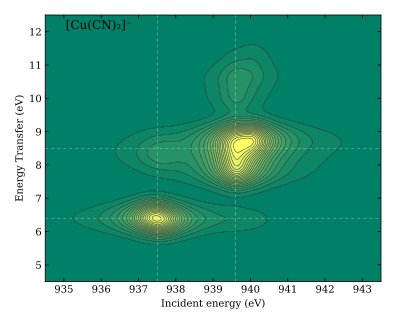

# Core spectroscopy for [PySCF](https://github.com/pyscf/pyscf)
[](https://github.com/NathanGillispie/core-spec-pyscf/actions/workflows/ci.yml)
[](https://github.com/NathanGillispie/core-spec-pyscf/actions)

I'm proud to announce that this is the *first open-source implementation* of
excited-excited state transition moments from TDDFT response theory (for GGA +
LDA functionals and restricted references)! VeloxChem beat me to
frequency-dependent QR... This was very difficult, but necessary for my PhD
work.

This project initially began because PySCF had no support for ZORA or CVS. v0.4 
added support for quadratic response. That coalesced all of the features I created
across different Python scripts. Notably, I had different code for full QR without
ZORA, CVS, or TDA; and QR with all of those. Designing for all the different
use-cases and approximations was a fun puzzle.



This example RIXS map can be computed using scripts in [examples/rixs/cucn2_-](./examples/rixs/)

## Capabilities

1. **Quadratic Response**: currently, full QR is for restricted SCF and LDA/GGA
   functionals for RKS. Various approximations were added. Supports
   pre-computing or lazily evaluating $g^\text{xc}$. Supports LDA and RPA linear
   response. Supports providing two separate linear response calculations
   (manifolds) for $\alpha$ and $\beta$ perturbations. 
3. **Resonant Inelastic X-ray Scattering (RIXS) maps**: using averaged
   Kramers-Heisenberg equation, and transition moments from linear and quadratic
   response.
4. **Spin-orbit (MP)-ZORA + analytic gradients**: The best relativistic correction.[^3]
   Scalar-relativistic is also allowed. Analytic gradients for generalized SCF methods
   require PySCF >=2.15 \[or master branch at time of writing\].
6. **Core-Valence Separation (CVS)**: Supports direct-diagonalization. This is often
   much faster for conditions relevant to our work. Supports eliminating
   the $f^\text{xc}$ term. Recent results from Pak and Nascimento[^2] show that
   this term is expensive and unnecessary for qualitatively-accurate X-ray absorption spectra.
   Supports specifying core orbitals by index, or by energy window.

Core spectroscopy often involves excitations from a relatively small number of
core orbitals. Core orbitals and valence orbitals often have such different
localizations and energies that they are separable in the Schrödinger equation
to good approximation.[^1] This is the basis of the CVS approximation and is
highly effective for linear-response Time-Dependent Density Functional Theory
(TDDFT). As of PySCF 2.10, this is supported indirectly through the `frozen`
attribute. This code still adds a `CVS` mixin for specifying core orbitals
via index or energy window.
  
### Details
- The following QR approximations are implemented:
   - `"Nascimento"` for $X^{(\alpha\beta)}=Y^{(\alpha\beta)}=\mathbf{0}$
   - `"Pseudo"` for $\omega_\alpha + \omega_\beta \mapsto 0$ and
   - `"Zero"` for $g^\text{xc}=0$.
- QR as implemented in the `pyscf.qr` module builds immutable linear-response
  `Manifold` objects. Following PySCF conventions, TDA sets $Y$ to scalar 0, or tuple `(0,0)`.
  Frozen orbitals are set to 0 so that the shape of the excitation vectors is
  consistent, even for two different manifolds. Saving and loading QR to
  checkfiles always saves sufficient information to restart completely.
- QR solves a Casida-like equation for the off-diagonal blocks of the
  excited-to-excited transition density matrix (2TDM). The 2TDM is the main result,
  but helpers expose transition dipole moments and oscillator strengths for convenience.
- When removing the $f_\text{xc}$ term, the exact Hartree exchange is included,
  regardless of the functional used.
- The (MP)-ZORA correction uses a model basis obtained from
  [NWCHEM](https://nwchemgit.github.io/).

## Dependencies

This project requires nothing more than PySCF **>=2.7** to run. Ordinary QR and
ZORA energies are always supported. Other features vary by PySCF version. 

- **>=2.10**: QR calculations using frozen orbitals and the `pyscf.cvs` module require
  PySCF 2.10 or newer. On older versions, importing `pyscf.cvs` raises `ImportError`.
- **master/>=2.15**: ZORA GHF/GKS nuclear gradients and geometry optimization require PySCF's
  generalized nuclear-gradient implementation from the current development
  branch or 2.15 when available. Older versions raise `NotImplementedError`.

The QR example requires `matplotlib` to plot the data.

## Usage

### Quadratic response

Excited-to-excited state properties are computed with the `QR` driver in
`pyscf.qr`. Import the module, run a linear-response calculation, then
construct a `QR` object from the resulting TDSCF object:

QR calculations using frozen orbitals require PySCF >=2.10.

```py
from pyscf import gto, dft
from pyscf.tdscf import RPA
import pyscf.qr
from pyscf.qr import QR

mol = gto.M(...)
mf = dft.RKS(mol, xc='PBE0').run()

tdobj = RPA(mf).set(nstates=4)
tdobj.kernel()

qrobj = QR(tdobj)
tdm = qrobj.get_2tdm(0, 3)          # 2TDM for state 0 -> state 3
tdip = qrobj.transition_dipole(tdm)  # (x, y, z) dipole vector
```

TDSCF objects are consumed at initialization: if linear response has not been
run yet, `QR` calls `kernel()` for you and builds internal `Manifold` objects.
The original `tdobj` is not retained.

When both excited states come from the same active occupied subspace, a single
TDSCF object is enough. For excitations out of different core (frozen-orbital)
subspaces, pass two TDSCF objects that share the same mean-field reference:

```py
td_n = RPA(mf, frozen=frozen_idx_a).set(nstates=80)
td_m = RPA(mf, frozen=frozen_idx_b).set(nstates=40)

qrobj = QR(td_n, td_m)
tdm = qrobj.get_2tdm(2, 0)
```

Both `RPA` and `TDA` manifolds are supported; mixing TDA and RPA in a QR calculation is not allowed.

#### Options
- `precompute_gxc` (default `False`): when `True`, call `qrobj.kernel()` to
  fill the six-index $g_\text{xc}$ tensor in memory before repeated `get_2tdm`
  calls. *This must be done first.* The default lazy mode recomputes the grid
  contraction on each call and is faster for a small number of state pairs.
- `approximation`: approximate the $g_\text{xc}$ contribution. `None` (default)
  is the full quadratic response; `'Nascimento'` zeros the off-diagonal 2TDM
  blocks; `'Zero'` sets $g_\text{xc} \leftarrow 0$; `'Pseudo'` uses the
  pseudo-wavefunction approximation (shifts divergences to $\omega = 0$). The
  approximation can also be changed after construction, e.g. `qrobj.approximation
  = 'Pseudo'`.

#### Checkpoints
To pause after linear response and resume before the QR stage, save and restore manifold data:

```py
qrobj = QR(tdobj, chkfile='qr.chk')
qrobj.save()                       # LR results only; Gxc is not checkpointed

qrobj = QR.from_chk('qr.chk', mf)  # pass the mean-field object
qrobj.kernel()                     # optional; needed if precompute_gxc=True
tdm = qrobj.get_2tdm(0, 1)
```

See `examples/qr/LiH-all_approx.py` for a program demonstrating unphysical
divergences in the 2TDM. In it we show QR transition dipoles against FCI and
several $g_\text{xc}$ approximations. The produced graph is designed to
replicate ref. 4.[^5]


### ZORA

The Zeroth-Order Regular Approximation (ZORA) can be applied to any HF/KS
object by appending the `zora` method.
```py
from pyscf import gto, scf
import pyscf.zora
mol = gto.M(...)
mf = scf.RHF(mol).zora()
mf.run()
```
This is model-potential (MP) ZORA: the core Hamiltonian is replaced with a
(scalar-)relativistic counterpart built from tabulated atomic model potentials
Assign the return value (`mf =mf.zora()`).

Nuclear gradients and geometry optimization use the usual PySCF hooks:
```py
de = mf.Gradients().kernel()
mol_eq = mf.Gradients().optimizer().kernel()
```
When composing with density fitting, apply `.zora()` last
(`mf.density_fit().zora()`). GHF/GKS nuclear gradients and geometry
optimization require PySCF's generalized nuclear-gradient support. On older
PySCF versions, those operations raise `NotImplementedError`; RHF/RKS/UHF/UKS
gradients remain available.

Spin–orbit MP-ZORA is available on GHF/GKS:
```py
mf = scf.GHF(mol).zora(spin_orbit=True)
```
The ZORA quadrature level defaults to 8 (`mf.with_zora.grid_level`).
Grid-weight response is not implemented.

### Core-valence separation

You can specify excitations out of core orbitals by wrapping a TDHF/TDDFT
object with `.cvs()` after importing `pyscf.cvs`. Occupied orbitals that are
not listed in `core_idx` are frozen through PySCF's `frozen` attribute; the SCF
orbitals and `mol.nelec` are left unchanged. Assign the return value.
```py
from pyscf import gto, dft
from pyscf.tdscf import TDA, TDDFT, TDHF # etc.
import pyscf.cvs
mol = gto.M(...)
mf = dft.RKS(mol).run()

tdobj = TDDFT(mf).cvs(core_idx=[0, 1, 2])
tdobj.nstates = 80
tdobj.kernel()
```
Alternatively, select occupied core orbitals using an inclusive MO-energy
window. Virtual orbitals are not selected by this window and remain active:
```py
tdobj = TDDFT(mf).cvs(core_window=(-20.0, -10.0))
tdobj.kernel()
```
The CVS module requires PySCF's TDSCF frozen-orbital support, available in
PySCF 2.10 and newer. On older versions, importing `pyscf.cvs` raises
`ImportError`.

For unrestricted references, excitations out of the alpha and beta orbitals are
specified as a tuple, `([0,1], [0,1])`. Extra virtuals may be frozen on one
spin so both spins keep the same number of active MOs (required by PySCF's UHF
Davidson solver). You can also assign `tdobj.frozen` directly using the usual
PySCF convention.

For UHF/UKS, `core_window=(emin, emax)` applies to both spins. Separate windows
can be supplied as `((emin_alpha, emax_alpha), (emin_beta, emax_beta))`.

To disable the $f_\text{xc}$ term, pass `no_fxc=True`. This uses an HF-like
kernel for response methods without modifying the underlying mean-field or
TD object. Supports both Davidson and direct diagonalization via `direct_diag=True`.
```py
import pyscf.cvs

tdobj = TDHF(mf).cvs(no_fxc=True)
tdobj.kernel()
```

## Installation
The recommended installation method is to use `pip` with some kind of virtual
environment (venv, conda, etc.)

### Pip
This software is avilable in [PyPI](https://pypi.org/project/core-spec-pyscf/),
so it can be installed with
```sh
pip install core-spec-pyscf
```
To request the CVS constraint (PySCF>=2.10) explicitly:
```sh
pip install "core-spec-pyscf[cvs]"
```
Alternatively, install the latest version from the
[GitHub](https://github.com/NathanGillispie/core-spec-pyscf) repo with
```sh
pip install git+https://github.com/NathanGillispie/core-spec-pyscf.git
```
If using `conda`, use the `pip` installed in your environment. Some call this
"bad practice", I call it time spent *not* running core-valence separated TDDFT
calculations.

### Source build
This should only be done if you know what you're doing. After [installing and
building](https://pyscf.org/user/install.html#build-from-source) PySCF, add the
root of this repo to the `PYSCF_EXT_PATH` environment variable. But be warned,
this variable causes problems for pip installations of PySCF.

### Development mode
`pip` has a handy feature called editable installations. In a virtual
environment with PySCF and its dependencies, run
```sh
pip install -e ./core-spec-pyscf
```

You can find details on other extensions in the
[extensions](https://pyscf.org/user/extensions.html#how-to-install-extensions)
page of the [PySCF website](https://pyscf.org).

### Tests

Follow the PySCF conventions, I use `pytest` for tests.

## TODO:
- [ ] $\omega$-dependent Quadratic Response
- [ ] 2-photon absorption
- [ ] Add support for unrestricted and generalized QR even if it means limiting to a specific approximation type.
- [ ] Add support for unrestricted and generalized RIXS.
- [ ] Add support for perturbative-SO ZORA.
- [x] Cache 2TDM intermediate quantities.
- [x] Add Gxc approximations
- [x] Transition dipole moment (restricted)
- [x] Option to compute $g_\text{xc}$ at once or on-the-fly
- [x] Frozen orbitals
- [x] Checkpoints

[^1]: Cederbaum, L. S.; Domcke, W.; Schirmer, J. Many-Body Theory of Core Holes. _Phys. Rev. A_ **1980**, _22_ (1), 206–222. [doi.org/10.1103/PhysRevA.22.206](https://doi.org/10.1103/PhysRevA.22.206).

[^2]: Pak, S.; Nascimento, D. R. The Role of the Coupling Matrix Elements in Time-Dependent Density Functional Theory on the Simulation of Core-Level Spectra of Transition Metal Complexes. _Electron. Struct._ **2024**, _6_ (1), 015014. [doi.org/10.1088/2516-1075/ad2693](https://doi.org/10.1088/2516-1075/ad2693).

[^3]: In my opinion.

[^4]: Casida, M. E. Time-Dependent Density Functional Response Theory for Molecules. In _Recent Advances in Density Functional Methods_; Recent Advances in Computational Chemistry; World Scientific, **1995**; Vol. 1, pp 155–192. [doi.org/10.1142/9789812830586_0005](https://doi.org/10.1142/9789812830586_0005)

[^5]: Parker, S. M.; Roy, S.; Furche, F. Unphysical Divergences in Response Theory. _J. Chem. Phys._ **2016**, _145_ (13), 134105. [doi.org/10.1063/1.4963749](https://doi.org/10.1063/1.4963749)

