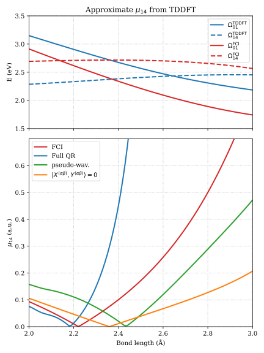

# Core spectroscopy for [PySCF](https://github.com/pyscf/pyscf)
[](https://github.com/NathanGillispie/core-spec-pyscf/actions/workflows/ci.yml)
[](https://github.com/NathanGillispie/core-spec-pyscf/actions)

I'm proud to announce that this is the *first open-source implementation* of excited-excited state transition moments from TDDFT response theory (for GGA + LDA functionals and restricted references)! VeloxChem beat me to frequency-dependent QR... This was very difficult, but necessary for my PhD work.

## Background
Core spectroscopy often involves excitations from a relatively small number of core orbitals. This is a huge advantage for linear response Time-Dependent Density Functional Theory (TDDFT) since you can apply core-valence separation. In theory, core orbitals and valence orbitals have such vastly different localizations and energies that they are separable in the Schrödinger equation to good approximation.[^1]

PySCF provides a good basis for TDDFT calculations. However, some things are inconvenient for core-level spectroscopy:

1. **Davidson diagonalization** is comically slow, around 100x slower than direct diagonalization under conditions relevant to our work, due to excitations from a small number of core orbitals. Also, we often require hundreds of states in our TDDFT calculations, outweighing the benefits of the Davidson scheme. A **direct diagonalization** of the AB matrices using `*.linalg.eigh` is simply the better option here.

2. **Exchange and correlation** terms are often the most computationally expensive part of response TDDFT calculations. However, recent results from Pak and Nascimento[^2] show that the term is unnecessary for qualitatively-accurate X-ray absorption spectra.

3. **No ZORA.** The best scalar-relativistic correction.[^3]

4. **Quadratic response** is not available in PySCF. This extension implements excited-to-excited state transition dipole moments from TDDFT response theory (restricted RHF/RKS, LDA and GGA functionals) which we use for Resonant-Inelastic X-ray Scattering calculations.

5. **No core-valence separation approximation.** Update: this was added recently as an option to specify frozen orbitals.

### Details
- The diagonalization of Casida's equation[^4]
```math
\begin{pmatrix}\mathbf{A} & \mathbf{B}\\ \mathbf{-B}&\mathbf{-A}\end{pmatrix}\begin{pmatrix}\mathbf{X}\\ \mathbf{Y}\end{pmatrix}=\Omega \begin{pmatrix}\mathbf{X}\\ \mathbf{Y}\end{pmatrix}
```
is done in its hermitian form, assuming $(\mathbf{A}-\mathbf{B})$ and $(\mathbf{A}+\mathbf{B})$ are positive semi-definite:
```math
\begin{gather}\mathbf{CZ}=\Omega^2 \mathbf{Z}\\ \mathbf{C} = (\mathbf{A}-\mathbf{B})^{1/2}(\mathbf{A}+\mathbf{B})(\mathbf{A}-\mathbf{B})^{1/2}\\ \mathbf{Z} = (\mathbf{A}-\mathbf{B})^{1/2}(\mathbf{X}-\mathbf{Y})\end{gather}
```
- When removing the $f_\text{xc}$ term, the exact Hartree exchange is included, regardless of the functional used. Due to technical reasons, direct diagonalization is always used with `no_fxc`. Given the reasons above, I probably won't change this.
- The ZORA correction uses a model basis. The exact values come from [NWCHEM](https://nwchemgit.github.io/).
- Quadratic response is implemented in `pyscf.qr` for restricted RHF/RKS references (RPA and TDA). The driver builds linear-response manifolds from TDSCF objects, solves a Casida-like equation for the off-diagonal blocks of the excited-to-excited transition density matrix (2TDM), and exposes transition dipole moments and oscillator strengths.

## Usage

### ZORA

The Zeroth-Order Regular Approximation (ZORA) can be applied to any HF/KS object by appending the `zora` method.
```py
from pyscf import gto, scf
import pyscf.zora
mol = gto.M(...)
mf = scf.RHF(mol).zora()
mf.run()
```
This is model-potential (MP) ZORA: the core Hamiltonian is replaced with a scalar-relativistic counterpart built from tabulated atomic model potentials (not a self-consistent molecular KS potential). Assign the return value (`mf = mf.zora()`).

Nuclear gradients and geometry optimization use the usual PySCF hooks:
```py
de = mf.Gradients().kernel()
mol_eq = mf.Gradients().optimizer().kernel()
```
When composing with density fitting, apply `.zora()` last (`mf.density_fit().zora()`).

Spin–orbit MP-ZORA is available on GHF/GKS:
```py
mf = scf.GHF(mol).zora(spin_orbit=True)
```
The ZORA quadrature level defaults to 8 (`mf.with_zora.grid_level`). Grid-weight response, GTH pseudopotential gradients, and picture-change properties are not implemented.

### Core-valence separation

You can specify excitations out of core orbitals by adding a `core_idx` attribute to the TDHF/TDDFT object after importing `pyscf.cvs`.
```py
from pyscf import gto, dft
from pyscf.tdscf import TDA, TDDFT, TDHF # etc.
import pyscf.cvs
mol = gto.M(...)
mf = dft.RKS(mol).run()

tdobj = TDDFT(mf)
tdobj.nstates = 80
tdobj.core_idx = [0,1,2] # wow! so easy
tdobj.kernel()
```
For unrestricted references, excitations out of the alpha and beta orbitals are specified in a tuple. Note that this is destructive to the SCFs `mo_coeff`, `mo_occ`, `mo_energy` and MOLs `nelec`. I might fix that later.

To disable the $f_\text{xc}$ term, set the `no_fxc` attribute or keyword argument of the `kernel` function. The same syntax is used for direct diagonalizaton (`direct_diag`). Note that `pyscf.cvs` must still be imported as all the direct diagonalization code lives there.
```py
import pyscf.cvs

tdobj = TDHF(mf)
tdobj.no_fxc = True
tdobj.direct_diag = True
tdobj.kernel()
```

### Quadratic response

Excited-to-excited state properties are computed with the `QR` driver in `pyscf.qr`. Import the module, run a linear-response calculation, then construct a `QR` object from the resulting TDSCF object:

```py
from pyscf import gto, dft
from pyscf.tdscf import RPA
import pyscf.qr
from pyscf.qr import QR

mol = gto.M(...)
mf = dft.RKS(mol, xc='PBE0').run()

tdobj = RPA(mf).set(nstates=4)
tdobj.kernel()

qrobj = QR(tdobj)
tdm = qrobj.get_2tdm(0, 3)          # 2TDM for state 0 -> state 3
tdip = qrobj.transition_dipole(tdm)  # (x, y, z) dipole vector
```

TDSCF objects are consumed at initialization: if linear response has not been run yet, `QR` calls `kernel()` for you and builds internal `Manifold` objects. The original `tdobj` is not retained.

When both excited states come from the same active occupied subspace, a single TDSCF object is enough. For excitations out of different core (frozen-orbital) subspaces, pass two TDSCF objects that share the same mean-field reference:

```py
td_n = RPA(mf, frozen=frozen_idx_a).set(nstates=80)
td_m = RPA(mf, frozen=frozen_idx_b).set(nstates=40)

qrobj = QR(td_n, td_m)
tdm = qrobj.get_2tdm(2, 0)
```

Both `RPA` and `TDA` manifolds are supported; mixing TDA and RPA in a QR calculation is not allowed.

#### Options
- `precompute_gxc` (default `False`): when `True`, call `qrobj.kernel()` to fill the six-index $g_\text{xc}$ tensor in memory before repeated `get_2tdm` calls. The default lazy mode recomputes the grid contraction on each call and is usually faster for a small number of state pairs.
- `approximation`: approximate the $g_\text{xc}$ contribution. `None` (default) is the full quadratic response; `'Nascimento'` zeros the off-diagonal 2TDM blocks; `'Zero'` sets $g_\text{xc} \leftarrow 0$; `'Pseudo'` uses the pseudo-wavefunction approximation (shifts divergences to $\omega = 0$). The approximation can also be changed after construction, e.g. `qrobj.approximation = 'Pseudo'`.

**Note:** to use the precomputed gxc, you must run the `kernel` method.

#### Checkpoints
To pause after linear response and resume before the QR stage, save and restore manifold data:

```py
qrobj = QR(tdobj, chkfile='qr.chk')
qrobj.save()                       # LR results only; Gxc is not checkpointed

qrobj = QR.from_chk('qr.chk', mf)  # pass the live mean-field object
qrobj.kernel()                       # optional; needed if precompute_gxc=True
tdm = qrobj.get_2tdm(0, 1)
```

See `examples/qr/LiH-all_approx.py` for a program demonstrating unphysical divergences in the 2TDM. In it we show QR transition dipoles against FCI and several $g_\text{xc}$ approximations. The produced graph is designed to replicate ref. 5.[^5]



## Installation
The recommended installation method is to use `pip` with some kind of virtual environment (venv, conda, etc.)

### Pip
This software has been uploaded to [PyPI](https://pypi.org/project/core-spec-pyscf/), so it can be installed with
```sh
pip install core-spec-pyscf
```
Alternatively, install the latest version from the [GitHub](https://github.com/NathanGillispie/core-spec-pyscf) repo with
```sh
pip install git+https://github.com/NathanGillispie/core-spec-pyscf.git
```
If using `conda`, use the `pip` installed in your environment. Some call this "bad practice", I call it time spent *not* running core-valence separated TDDFT calculations.

### Source build
This should only be done if you know what you're doing. After [installing and building](https://pyscf.org/user/install.html#build-from-source) PySCF, add the `pyscf` dir of this repo to the `PYSCF_EXT_PATH` environment variable. But be warned, this variable causes problems for pip installations of PySCF.

### Development mode
`pip` has a handy feature called editable installations. In a virtual environment with PySCF and its dependencies, run
```sh
pip install -e ./core-spec-pyscf
```

You can find details on other extensions in the [extensions](https://pyscf.org/user/extensions.html#how-to-install-extensions) page of the [PySCF website](https://pyscf.org).

### Tests

I use `pytests` for unit tests.

## TODO:
- [ ] $\omega$-dependent Quadratic Response
- [ ] 2-photon absorption
- [x] Cache 2TDM intermediate quantities.
- [x] Add Gxc approximations
- [x] Transition dipole moment (restricted)
- [x] Option to compute $g_\text{xc}$ at once or on-the-fly
- [x] Frozen orbitals
- [x] Checkpoints
- [x] Add check for `if precompute_gxc and G is None`.

[^1]: Cederbaum, L. S.; Domcke, W.; Schirmer, J. Many-Body Theory of Core Holes. _Phys. Rev. A_ **1980**, _22_ (1), 206–222. [doi.org/10.1103/PhysRevA.22.206](https://doi.org/10.1103/PhysRevA.22.206).

[^2]: Pak, S.; Nascimento, D. R. The Role of the Coupling Matrix Elements in Time-Dependent Density Functional Theory on the Simulation of Core-Level Spectra of Transition Metal Complexes. _Electron. Struct._ **2024**, _6_ (1), 015014. [doi.org/10.1088/2516-1075/ad2693](https://doi.org/10.1088/2516-1075/ad2693).

[^3]: In my opinion.

[^4]: Casida, M. E. Time-Dependent Density Functional Response Theory for Molecules. In _Recent Advances in Density Functional Methods_; Recent Advances in Computational Chemistry; World Scientific, **1995**; Vol. 1, pp 155–192. [doi.org/10.1142/9789812830586_0005](https://doi.org/10.1142/9789812830586_0005)

[^5]: Parker, S. M.; Roy, S.; Furche, F. Unphysical Divergences in Response Theory. _J. Chem. Phys._ **2016**, _145_ (13), 134105. [doi.org/10.1063/1.4963749](https://doi.org/10.1063/1.4963749)

